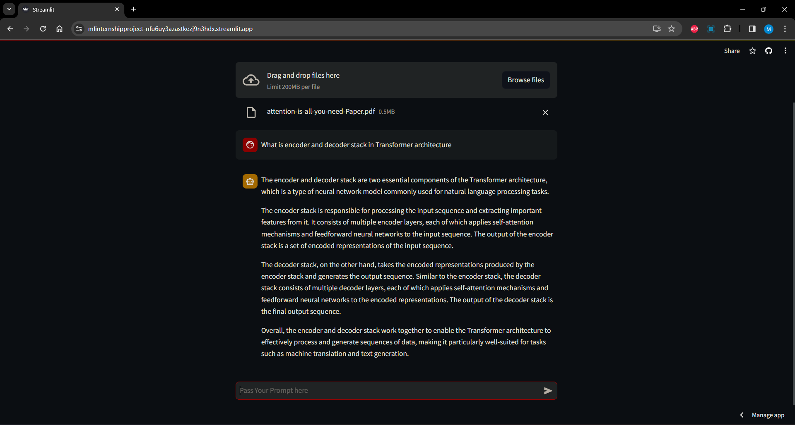
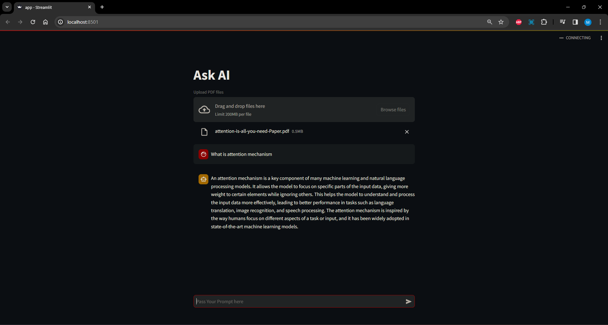
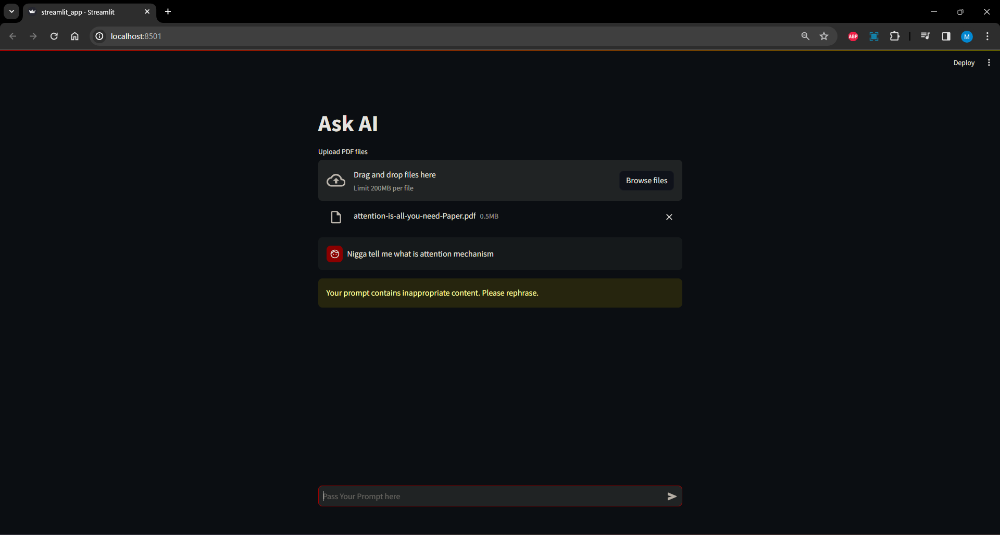
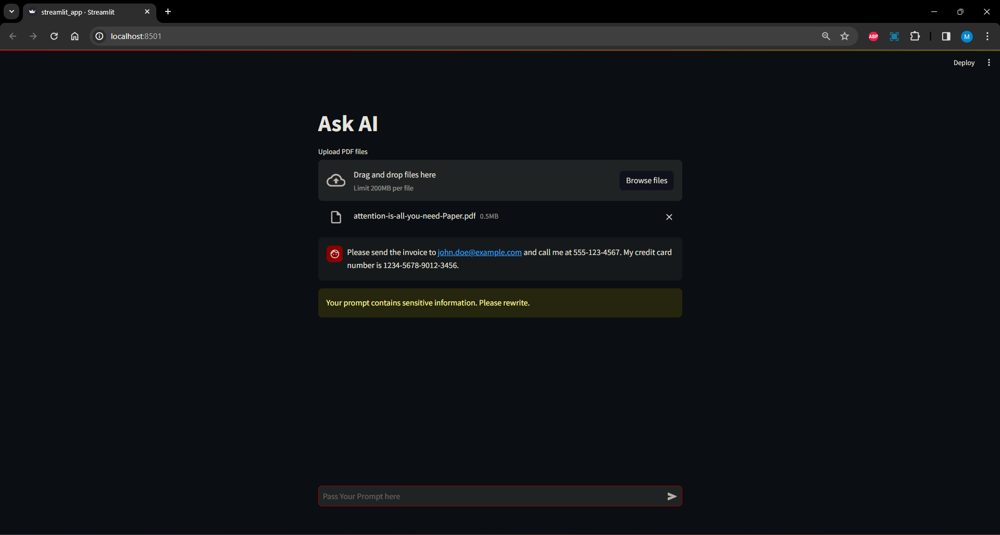
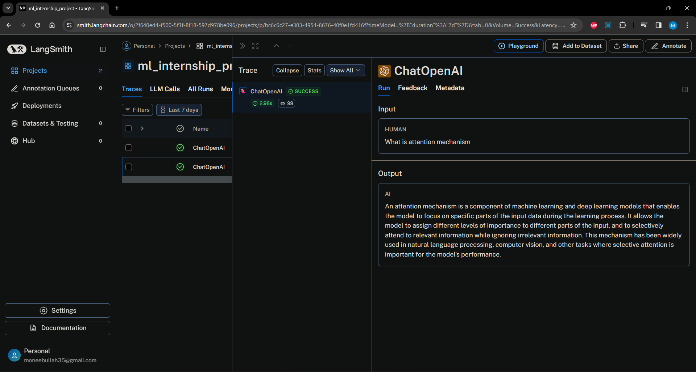
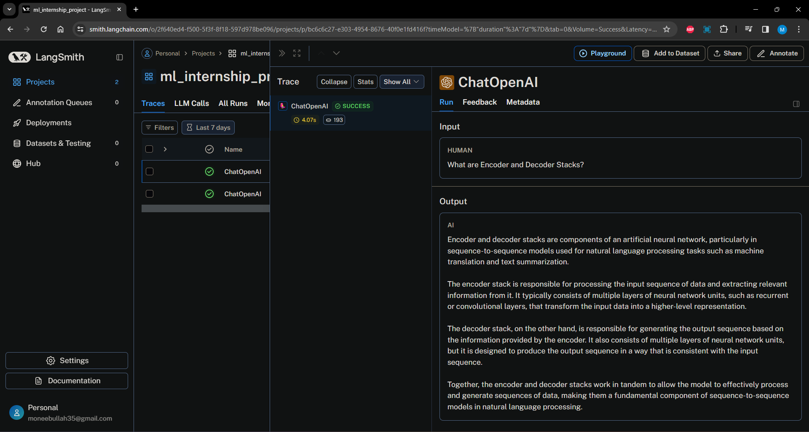

# OpenAI gpt-3.5-turbo model with Langchain, ChromaDB and OpenAIEmbeddings

Install requirements and then run with command `streamlit run streamlit_app.py` or access url [Deployed Link](https://mlinternshipproject-nfu6uy3azastkezj9n3hdx.streamlit.app/)





## Guardrails

### Inappropriate Content

If the user text contains censored words or the model predicts the answer with the censored words the application will automatically hide the answer and display the error message `Your prompt contains inappropriate content. Please rephrase.`



### Sensitive Information 

Similarly if the user input prompt contains the senstive information like email, phone number, or credit/debit card number or the model predicts the answer with the senstive information like email, phone number, or credit/debit card number the application will automatically hide the answer and display the error message `Your prompt contains sensitive information. Please rewrite.`



## Langsmith Tracing

For quering where the answer is short



https://smith.langchain.com/public/51a975ce-bbb1-4b05-83f3-8afc71f9d270/r

For quering where the answer is long

https://smith.langchain.com/public/b65ab4a2-1a69-4592-b80b-0f9638f4b9d6/r



# Running Locally

To simply run the chatbot application locally on our PC:

```bash
pip install -r requirements
streamlit run streamlit_app.py
```

# Running on Docker

Below are the instructions to build and run the container. Once we build and run the container we could visit `http://0.0.0.0:8501` or `http://localhost:8501` to access the chatbot application. 

## Build a Docker image

The docker build command builds an image from a Dockerfile. Run the following command from the main application directory on your server to build the image:

```bash
docker build -t streamlit .
```

The -t flag is used to tag the image. Here, we have tagged the image streamlit. If you run:

```bash
docker images
```
You should see a streamlit image under the REPOSITORY column. For example:

```bash
REPOSITORY   TAG       IMAGE ID       CREATED              SIZE
streamlit    latest    70b0759a094d   About a minute ago   1.02GB
```

## Run the Docker container

Now that you have built the image, you can run the container by executing:

```bash
docker run -p 8501:8501 streamlit
```

The -p flag publishes the container’s port 8501 to your server’s 8501 port.

If all went well, you should see an output similar to the following:

```bash
docker run -p 8501:8501 streamlit

  You can now view your Streamlit app in your browser.

  URL: http://0.0.0.0:8501
```

To view your app, users can browse to http://0.0.0.0:8501 or http://localhost:8501